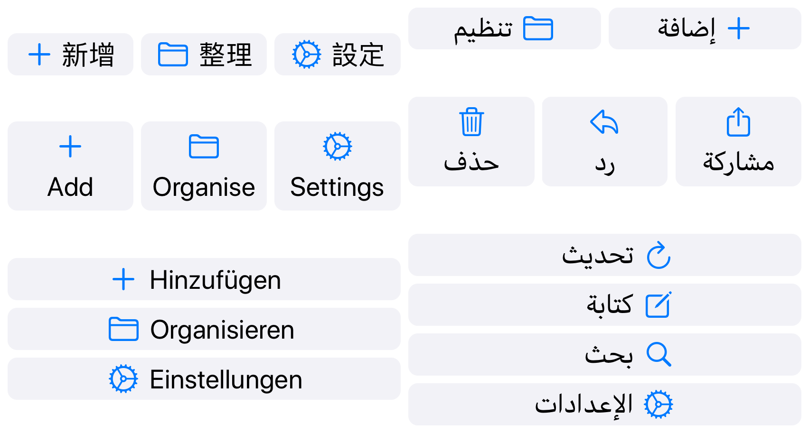

# DynamicButtonStack

DynamicButtonStack lays out a collection of buttons in either a column or a row. It dynamically adjusts the layout to suit the button content and the available space.

See the blog post to read more about [the problems solved by DynamicButtonStack and the design principles behind it.](https://douglashill.co/dynamic-button-stack/)



## Requirements

- DynamicButtonStack requires iOS 13 or later.
- The latest stable Xcode is expected.
- Works with both Swift and Objective-C apps.

## Installation

### Direct

1. Clone this repository or download [`DynamicButtonStack.swift`](DynamicButtonStack.swift) from GitHub.
2. Drag this file into your Xcode project and choose to add it to your target when prompted.

### Swift Package Manager

Add DynamicButtonStack to an existing Xcode project as a package dependency:

1. From the File menu, select Swift Packages › Add Package Dependency…
2. Enter `https://github.com/douglashill/DynamicButtonStack` as the package repository URL.

### CocoaPods

[DynamicButtonStack is available on CocoaPods](https://cocoapods.org/pods/DynamicButtonStack) as `DynamicButtonStack`. The module name when using CocoaPods is `DynamicButtonStackKit`.

## Usage

Your app provides a DynamicButtonStack with buttons and a maximum width. The DynamicButtonStack then provides your app the minimum width and height required. You app then gives the DynamicButtonStack at least that amount of space and the buttons will be nicely stacked within that space.

You can supply as many buttons as you like. Their titles can be as long as you like, and the font can be as large as you like. In exchange, give the button stack the height it needs. Therefore the button stack is typically best placed in a vertically scrolling view.

Create a `DynamicButtonStack` and give it an array of buttons that each have both an image and a title. Add the button stack to your view hierarchy.

```swift
let button = UIButton()
button.setImage(UIImage(systemName: "paperplane"), for: .normal)
button.setTitle("Send", for: .normal)

buttonStack = DynamicButtonStack(buttons: [
    button,
])

view.addSubview(buttonStack)
```

The button stack can be laid out with either `sizeThatFits` and `layoutSubviews` or using constraints.

When using constraints, the stack sets its vertical compression resistance priority to required because the buttons may be clipped otherwise. Typically a width constraint should be provided.

When using `layoutSubviews`, the frame should be set with a size at least as large as the size returned from `sizeThatFits` (in both dimensions). Measure the minimum size using `sizeThatFits`. Pass your container’s width limit and an unlimited height. An assertion will fail if the height is not unlimited. This is a reminder that handling restricted heights is not currently supported.

```swift
override func layoutSubviews() {
    super.layoutSubviews()
    
    let availableSize = CGSize(width: bounds.width, height: .greatestFiniteMagnitude)
    let requiredSize = buttonStack.sizeThatFits(availableSize)
    buttonStack.frame = CGRect(origin: .zero, size: requiredSize)
}
```

The buttons can be styled however you like. Colour, font, shadow, highlight state etc.

- Set both an image and a title.
- Don’t modify the `imageEdgeInsets` or `titleEdgeInsets` because DynamicButtonStack needs to adjust these to set the stacking and alignment inside the buttons.
- Customise any other properties however you like. Setting `contentEdgeInsets` is recommended.

## Status

✅ DynamicButtonStack is considered ready for use in production.

↔️ Respects both left-to-right and right-to-left layouts.

😇 There is no private API use or interference with private subviews.

## Q & A

### Which scheme should be used for development?

There are two identical schemes in the Xcode project to [encourage Swift Package Index to build the Swift package instead of trying to build the demo app](https://swiftpackageindex.com/docs/builds#built-how). Therefore it makes no difference which scheme is used for development. 

## Credits

DynamicButtonStack is a project from [Douglas Hill](https://douglashill.co/) and was developed for my [reading app](https://douglashill.co/reading-app/).

## Licence

MIT license — see License.txt
